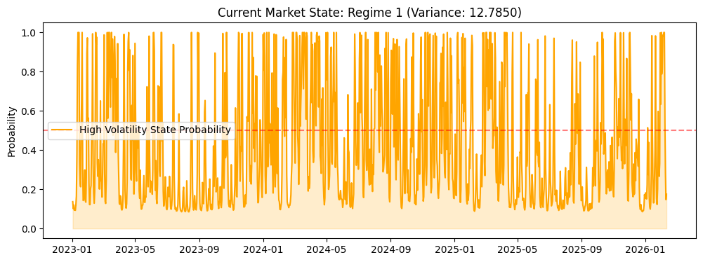
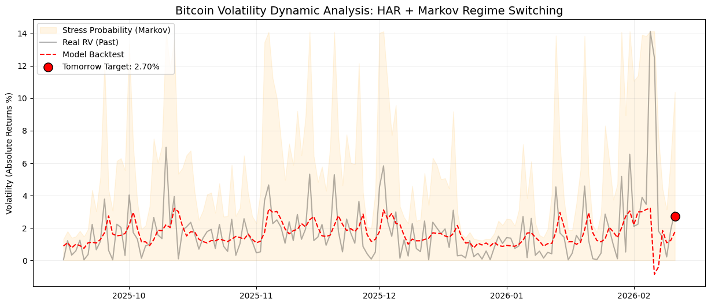

# Bitcoin Volatility Forecasting: A Hybrid HAR-Markov Approach

## Overview
This project implements an advanced econometric framework to estimate and forecast Bitcoin (BTC-USD) volatility. The model integrates a **Markov Switching Regression** with a **Heterogeneous Auto-Regressive (HAR)** structure. By combining these methodologies, the system captures volatility persistence across daily, weekly, and monthly horizons while adjusting for latent market states (Calm vs. Stress).

## Key Methodology
* **Regime Identification**: Uses `MarkovRegression` to endogenously detect structural shifts in return variance.
* **Hybrid Forecasting**: Incorporates Markovian state probabilities as a lagged feature in an OLS-based HAR model to improve predictive accuracy.
* **Risk Management**: Generates Value-at-Risk (VaR) estimates using Normal Parametric, T-Student Parametric (fat-tail adjusted), and Historical Non-Parametric approaches.

## Visual Analysis

### 1. Market Regime Detection
The model calculates the real-time probability of being in a "High Volatility" state. Signals are generated when the probability exceeds a defined threshold (e.g., 80%).

*Figure 1: Probability of the high-volatility regime (Regime 1) over time.*

### 2. Dynamic Volatility Forecast
The integrated model tracks realized volatility (RV) and produces a one-day-ahead target. This allows for proactive risk adjustments based on current market stress.

*Figure 2: Realized Volatility vs. Model Backtest and Predicted Target.*

## Technical Stack
* **Language**: Python 3.x
* **Data Sourcing**: `yfinance`
* **Modeling**: `statsmodels` (MarkovRegression, OLS), `scipy`
* **Visualization**: `matplotlib`

## How to Use
1. Ensure all dependencies are installed: `pip install yfinance statsmodels scipy matplotlib`.
2. Run the script to fetch the latest BTC-USD data and generate the regime analysis.
3. The variable `pred_tomorrow` provides the volatility forecast used for the Value-at-Risk calculations.

## License
MIT License
